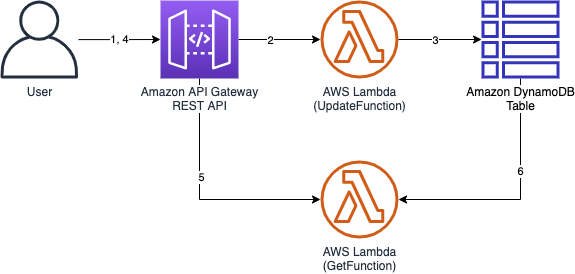

# CDK Serverless Pytest Example

This project is an example for pythonistas on serverless land.
Writing unittest will help developers to collaborate with colleagues when they are working on shared CDK Stacks.



Introducing application was inspired by Hit-Counter example on [CDKWorkshop](https://cdkworkshop.com/20-typescript.html)

# Prerequisites

- git
- awscli
- Python 3.8
- Nodejs 14
- AWS Account and locally configured AWS credential

# Installation

install dependencies

```bash
$ cd infra
$ npm i -g cdk@1.129.0
$ npm i
$ cdk bootstrap
```

open [**config.ts**](infra/lib/constants/config.ts) and edit below variables (optional for prototyping).
1. *ns* - namespace for the project, default is `CdkSlsPytest`

deploy the CDK app to your account

```bash
$ cdk deploy "*" --require-approval never
```

# Test

install dependencies

```bash
$ pip install pytest moto -U
```

run tests

```bash
$ npm run pytest
```

# Cleanup

```bash
$ cdk destroy "*"
```
